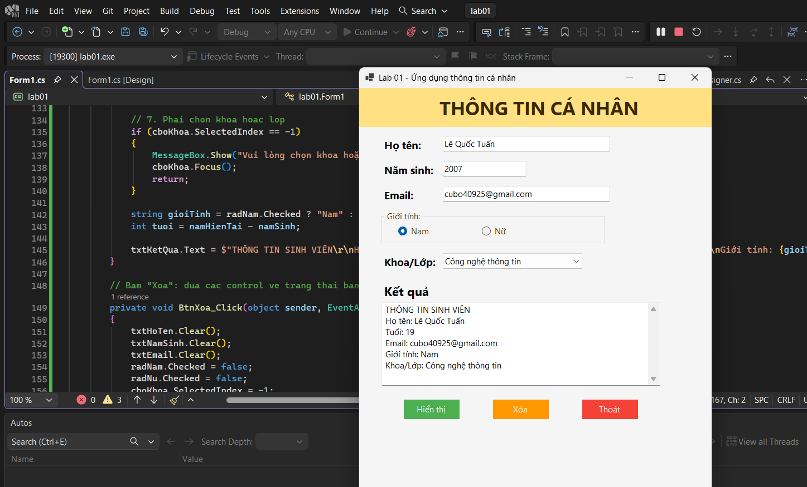
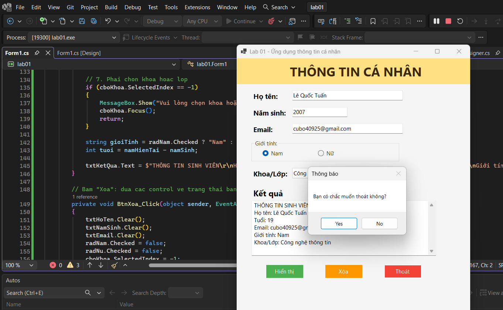

### Lab01 - Build chương trình nhập thông tin cá nhân

## Thông tin sinh viên
* **Họ tên:** Lê Quốc Tuấn
* **MSSV:** 51.01.104.115
* **Lớp:** 51.01.CNTT.A

## Mô tả
Ứng dụng WinForms cơ bản cho phép người dùng nhập và hiển thị thông tin cá nhân của sinh viên, kèm kiểm tra ràng buộc dữ liệu đầu vào.

## Chức năng
* Nhập thông tin: Họ tên, Năm sinh, Email.
* Lựa chọn: Giới tính (RadioButton), Khoa/Lớp (ComboBox).
* Nút Hiển thị: Kiểm tra dữ liệu hợp lệ và xuất kết quả.
* Nút Xóa: Đặt lại toàn bộ dữ liệu nhập về mặc định.
* Nút Thoát: Xác nhận người dùng trước khi đóng chương trình.

## Cách chạy
1. Mở file `lab01.slnx` bằng Visual Studio.
2. Nhấn `F5` (hoặc nút Start) run code

## Hình ảnh minh họa chương trình

### 1) Hiển thị được thông tin cá nhân thành công

### 2) Xác nhận đóng/thoát chương trình

### 3) Lỗi nhập tên

### 4) Lỗi nhập năm sinh

### 5) Lỗi nhập email

### 6) Lỗi nhập giới tính

### 7) Lỗi nhập khoa/lớp

