### Lab02 - C# cơ bản: Quản lý mảng số nguyên bằng Console

## Thông tin sinh viên
* **Họ tên:** Lê Quốc Tuấn
* **MSSV:** 51.01.104.115
* **Lớp:** 51.01.CNTT.A

## Mô tả
Ứng dụng C# Console App cho phép quản lý một mảng số nguyên thông qua menu điều khiển. Chương trình được tổ chức thành các phương thức nhỏ, hỗ trợ nhập/xuất, tính toán, tìm kiếm, sắp xếp và kiểm tra dữ liệu đầu vào.

## Chức năng
* **1. Nhập mảng:** Nhập số lượng phần tử $n$ ($n > 0$) và các giá trị trong mảng.
* **2. Xuất mảng:** In toàn bộ các phần tử hiện có trong mảng ra màn hình.
* **3. Tính tổng:** Tính và xuất tổng tất cả các phần tử trong mảng.
* **4. Tìm lớn nhất và nhỏ nhất:** Tìm giá trị $Max$ và $Min$ của mảng.
* **5. Đếm chẵn/lẻ:** Thống kê số lượng phần tử chẵn và số lượng phần tử lẻ.
* **6. Sắp xếp tăng dần:** Sắp xếp mảng theo thứ tự tăng dần và in kết quả.
* **7. Tìm kiếm:** Nhập giá trị $x$ và xuất vị trí xuất hiện đầu tiên (nếu có).
* **0. Thoát:** Kết thúc chương trình.

## Cách chạy
1. Mở file `lab2.slnx` (hoặc `lab2.csproj`) bằng Visual Studio.
2. Nhấn `F5` (hoặc nút Start) để biên dịch và chạy chương trình.

## Hình ảnh minh họa chương trình

### 1) Mẫu Menu chính

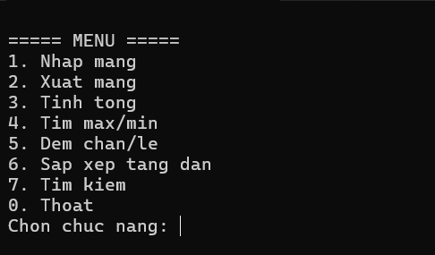

### 2) Nhập và xuất mảng
- Testcase 1: n = 4, 7 4 8 2

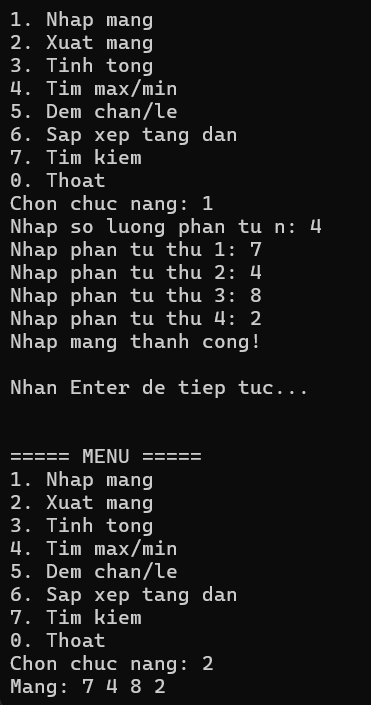

- Testcase 2: n = 6, -9 -11 -5 10 19 1
  
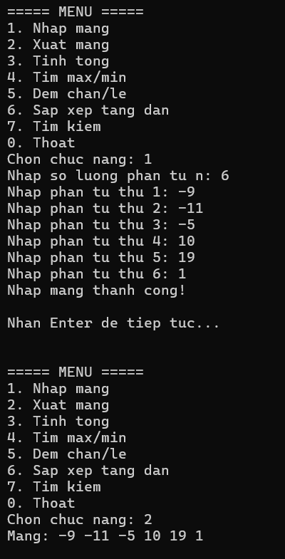

### 3) Tính tổng, tìm Max/Min, đếm chẵn/lẻ
- Testcase 1: n = 4, 7 4 8 2

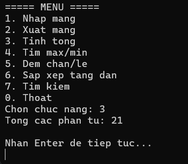

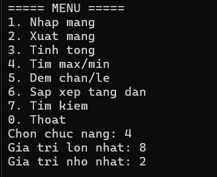

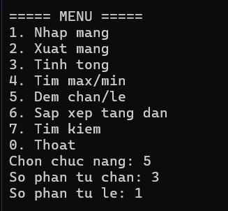

- Testcase 2: n = 6, -9 -11 -5 10 19 1

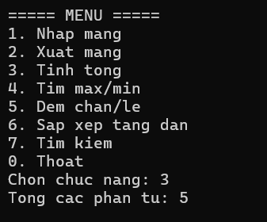

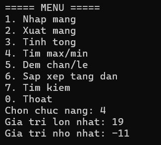

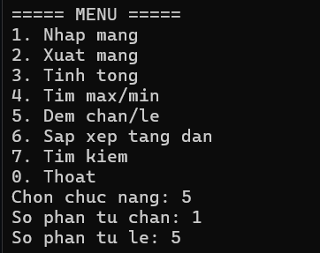

### 4) Sắp xếp tăng dần
- Testcase 1: n = 4, 7 4 8 2

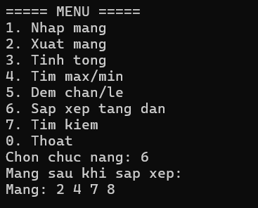

- Testcase 2: n = 6, -9 -11 -5 10 19 1

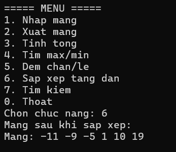

### 5) Tìm kiếm phần tử
- Testcase 1: n = 4, 7 4 8 2, 2

- Testcase 2: n = 6, -9 -11 -5 10 19 1, 11

### 6) Kiểm tra lỗi nhập dữ liệu (Validation)
- **Lỗi chọn chức năng xuất trước khi nhập mảng khi lần đầu chạy chương trình**

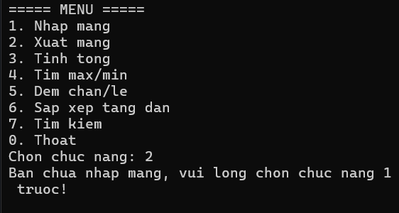

- **Lỗi nhập mảng âm**

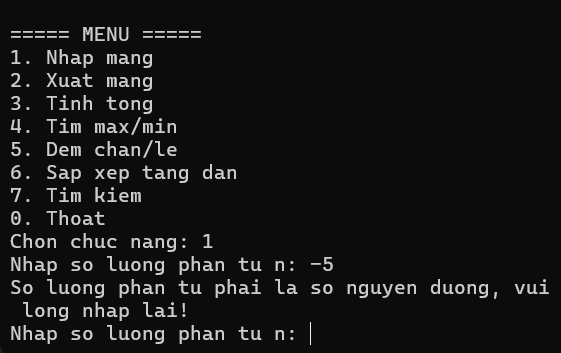

- **Lỗi nhập ký tự hay vì số để chọn chức năng**

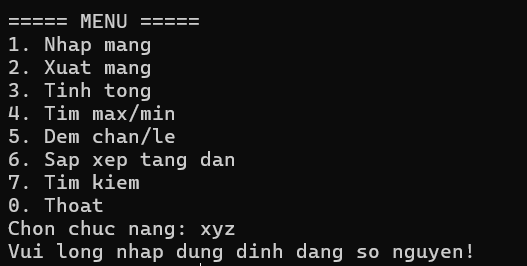

