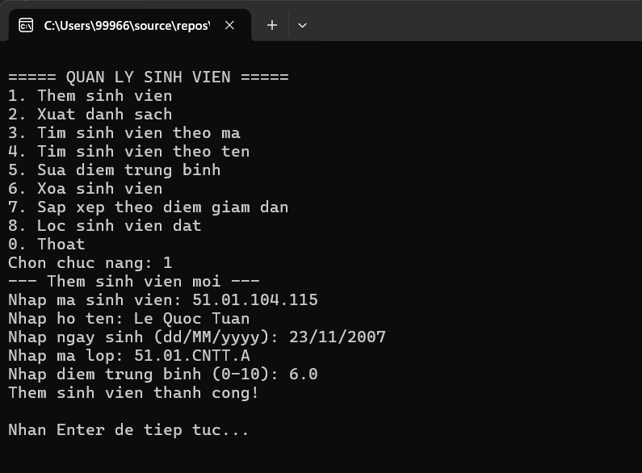
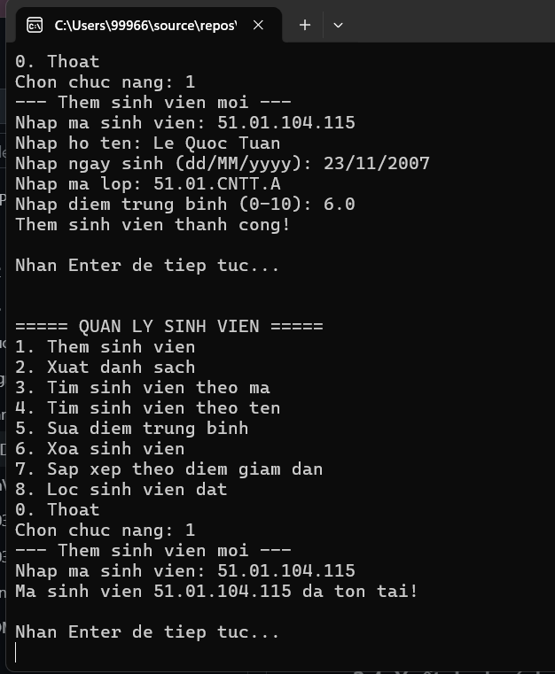
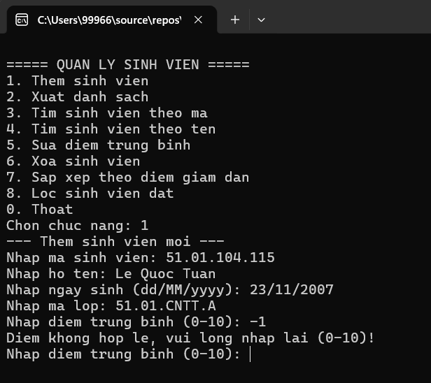
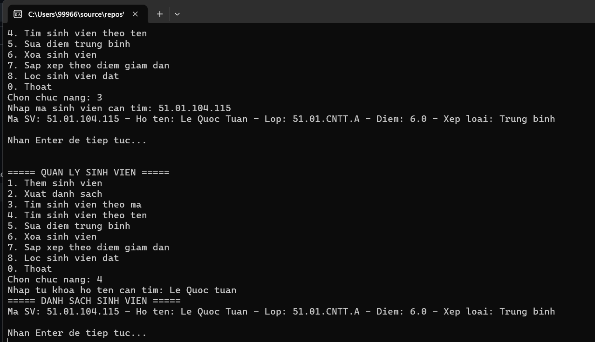
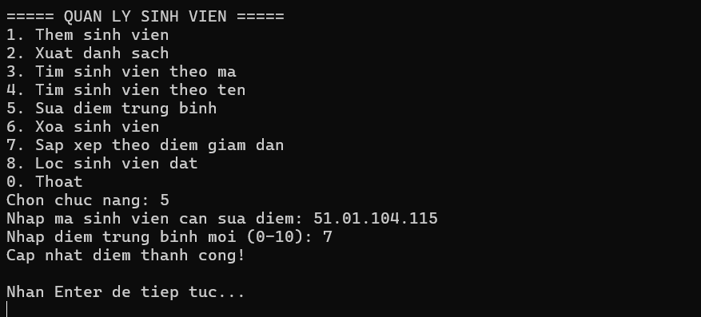
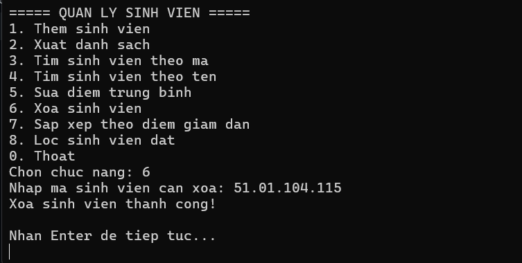
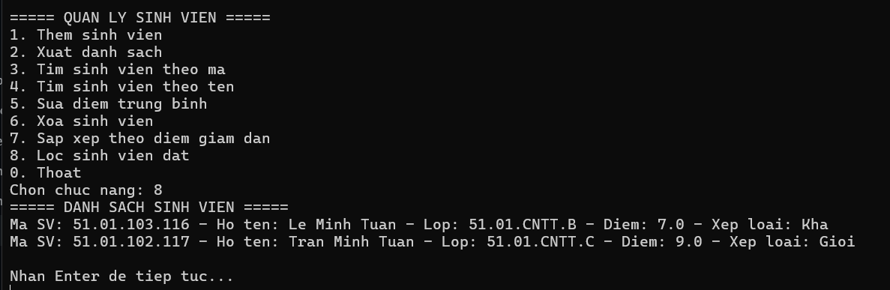

# BÁO CÁO THỰC HÀNH LAB 03

## CHỦ ĐỀ: LẬP TRÌNH HƯỚNG ĐỐI TƯỢNG C# - HỆ THỐNG QUẢN LÝ SINH VIÊN BẰNG CONSOLE APP

* **Học phần:** 2611COMP101904 - Lập trình trên Windows
* **Sinh viên thực hiện:** Lê Quốc Tuấn
* **MSSV:** 51.01.104.115
* **Lớp:** 51.01.CNTT.A
* **Môi trường phát triển:** Microsoft Visual Studio - C# Console App
* **Mô hình thiết kế:** Lập trình hướng đối tượng (OOP) & LINQ Query

---

## 1. Mục tiêu và Kiến trúc Mã nguồn

Dự án tập trung giải quyết bài toán quản lý danh sách sinh viên theo mô hình hướng đối tượng, bảo đảm áp dụng nguyên tắc thiết kế sạch (Clean Code) và các đặc tính OOP cốt lõi:

1. **Tính kế thừa (Inheritance):** Lớp `SinhVien` kế thừa từ lớp cha `Nguoi`, tái sử dụng các thuộc tính cơ bản (`HoTen`, `NgaySinh`) và mở rộng thêm các thuộc tính học vụ (`MaSinhVien`, `DiemTrungBinh`, `MaLop`) qua constructor `base()`.
2. **Tính đa hình (Polymorphism):** Định nghĩa phương thức `LayThongTin()` dạng `virtual` tại lớp cha `Nguoi` và tiến hành `override` tại lớp `SinhVien` để tự động mở rộng định dạng hiển thị thông tin.
3. **Tính đóng gói & Ràng buộc dữ liệu (Encapsulation & Validation):** Bảo vệ thuộc tính `DiemTrungBinh`, kiểm soát miền giá trị hợp lệ bắt buộc từ `0.0` đến `10.0`. Thống kê xếp loại tự động qua phương thức `XepLoai()`.
4. **Tách biệt vai trò (Separation of Concerns):** 
   * `Nguoi.cs` & `SinhVien.cs`: Định nghĩa cấu trúc thực thể.
   * `QuanLySinhVien.cs`: Tầng dịch vụ nghiệp vụ (Service Layer) trực tiếp thao tác với `List<SinhVien>`.
   * `Program.cs`: Tầng giao diện người dùng (UI Console) điều hướng menu và xử lý ngoại lệ nhập liệu.
5. **Truy vấn LINQ (Language Integrated Query):** Áp dụng các phương thức mở rộng LINQ (`.Where()`, `.OrderByDescending()`, `.FirstOrDefault()`) cho các thao tác tra cứu, lọc danh sách và sắp xếp.

---

## 2. Thực nghiệm và Đánh giá kết quả kiểm thử (Test Cases)

### 2.1. Thêm mới sinh viên và tính xếp loại tự động
Khởi tạo thành công sinh viên mới, kiểm tra việc tự động tính toán xếp loại dựa trên điểm trung bình:

### 2.2. Kiểm soát trùng lặp mã sinh viên (Primary Key Validation)
Hệ thống từ chối thêm mới và đưa ra thông báo cảnh báo khi nhập trùng `MaSinhVien` đã tồn tại trong danh sách:

### 2.3. Ràng buộc toàn vẹn điểm trung bình [0.0 - 10.0]
Chương trình yêu cầu nhập lại nếu người dùng nhập điểm số âm hoặc vượt quá 10:

### 2.4. Xuất danh sách và Truy vấn tìm kiếm sinh viên (LINQ Filter)
Hiển thị toàn bộ danh sách sinh viên hoặc lọc sinh viên theo mã/họ tên không phân biệt hoa thường:

### 2.5. Cập nhật điểm và Xóa sinh viên
Cập nhật lại điểm trung bình hoặc xóa sinh viên ra khỏi bộ nhớ `List<SinhVien>` theo mã:

### 2.6. Sắp xếp giảm dần & Lọc sinh viên đạt chuẩn (LINQ Expression)
Sắp xếp danh sách theo điểm từ cao đến thấp và lọc danh sách các sinh viên đạt điều kiện (`DiemTrungBinh >= 5.0`):

---

## 3. Hướng dẫn Chạy ứng dụng

1. Mở Solution bằng Visual Studio.
2. Đảm bảo cấu trúc dự án bao gồm các tệp: `Nguoi.cs`, `SinhVien.cs`, `QuanLySinhVien.cs`, `Program.cs`.
3. Nhấn **F5** (hoặc nút **Start**) để biên dịch và bắt đầu chạy chương trình.
